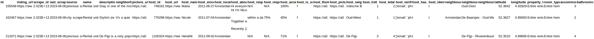

# Airbuy - pipeline
The intention of this project is to understand which cities offer the best Airbnb rental returns when compared to 
initial property purchase investment.

# Plan
1. Define questions I want to ask of data
2. Find suitable data to answer questions
3. Determine limitations imposed by data and rescope my initial questions if necessary
4. Design app components and data transformations
5. Prototype ETL procedures in Jupyter notebooks
6. Implement components in productionised code

## Questions I want to answer
1. Which cities offer the best Airbnb rental returns when compared to initial property purchase investment?
2. How many days would I need to rent out my property to break even on my initial investment (excl inflation, interest, etc)?
3. How many days would I need to rent out my property to break even on my initial investment (incl inflation, interest, etc)?

## Data sources
After some research, I found the following data sources:
### Airbnb listings data
[Inside Airbnb](http://insideairbnb.com/get-the-data.html) - Listings data for many cities around the world 

#### Sample of Amsterdam listings data:

#### Observations and limitations
* Data does not contain a column for property size:
  * Will need to estimate average property size using the number of bedroom. As Global Property Guide data is for 2-bedroom apartments, I will need to restrict my analysis to 2-bedroom apartments in the Inside Airbnb data.
* Most of the columns are irrelevant to our purposes
  * Will drop irrelevant columns
* Data is split across many csv files, one for each city.
  * Will therefore need to process each file separately and then combine into a single dataset.
  * It might be useful to build a scraping tool to automatically download all files and label appropriately instead of manually downloading each file.
 
### Global Property Guide data
[Global Property Guide](https://www.globalpropertyguide.com/most-expensive-cities) - Shows the buying price, price/rent ratio, rent per month (US$), and gross rental yield (%) for a 2-bedroom apartment in the capital city in a central location.

#### Sample of data:

#### Observations and limitations
* Data is not available for all cities in Inside Airbnb data.
  * Will therefore need to restrict my analysis to cities that are present in both datasets.
* Website states "Figures are typically based on the average for a 2-bedroom apartment in the capital city in a central location.".
  * Will therefore need to restrict my analysis to 2-bedroom apartments in the Inside Airbnb data.
* Data lists average buying price (in USD) per square metre.
  * Will therefore need to estimate the average property size for each listing in the AirBnb data so that I can in turn calculate the average buying price per square meter, and hence make a comparison between data sets.
* Data is not in a downloadable format.
  * Will either need to build scraping tool to source directly from website, or manually copy and paste data into a csv file.
* Data does not contain city name, only country name, although it's implied that the data is for the capital city of each country.
  * Will therefore need to add city name to each entry by looking up the capital city of each country.
* Some of the columns are irrelevant to our purposes
  * Will drop irrelevant columns

### Capital Cities
[WorldCapitalCities](https://population.un.org/wup/Download/Files/WUP2018-F13-Capital_Cities.xls) - List of capital cities around the world

#### Sample of data:

#### Observations and limitations
* Simple mapping of country name to capital city name.
  * Suitable to use as is

## Rescoped questions
Based on the limitations of the data, I have decided to restrict my analysis to 2-bedroom apartments in the capital city 
of each country. This means that I will not be able to answer my original question of "Which cities offer the best 
Airbnb rental returns when compared to initial property purchase investment?" as I will only be able to compare Airbnb 
rental returns for 2-bedroom apartments in the capital city of each country. I will therefore rephrase my question to 
"Which capital cities offer the best Airbnb rental returns for 2-bed apartments when compared to initial property purchase investment?".

1. Which capital cities offer the best Airbnb rental returns for 2-bed apartments when compared to initial property purchase investment?
2. How many days would I need to rent out my property to break even on my initial investment (excl inflation, interest, etc)?
3. How many days would I need to rent out my property to break even on my initial investment (incl inflation, interest, etc)?

## App components
Having analysed the data sources and business questions, I have identified the following components that I will need to build.

### ETL Pipeline
The ETL app will be responsible for extracting data from the data sources, transforming the data into required format, and loading the data into a database.

Modules will include:
* Data scraper - to download and label all Inside Airbnb data files from the Inside Airbnb website. Files will be saved in CSV format.
* Airbnb ETL - to transform all the Airbnb data into a single dataset that can be written to the database.
* Global Property Guide ETL - to transform the Global Property Guide data into a single dataset that can be written to the database.
* Database - to store the transformed data.

Tech stack:
* Python - for orchestrating the ETL process
* Pandas - for data wrangling
* SQLAlchemy - for database interaction
* BeautifulSoup - for web scraping

### Data Storage 
The data storage app will be responsible for storing the transformed data in an SQL database.

Modules will include:
* Database - to store the transformed data.
* Docker - to containerise the database.

Tech stack:
* PostgreSQL - for storing the data
* Docker - for containerising the database 

When all app components are complete, the database will be moved to a cloud storage system, e.g. AWS.

### API
The API app will be responsible for serving the data to the user.

Modules will include:
* API - to serve the data to the user.

Tech stack:
* FastAPI - for serving the data
* SQLAlchemy - for database interaction

## ETL data transformations
Diagramatic descriptions of how the data in each ETL pipeline will be transformed.

### Airbnb ETL

## Global Property Guide SQM ETL
